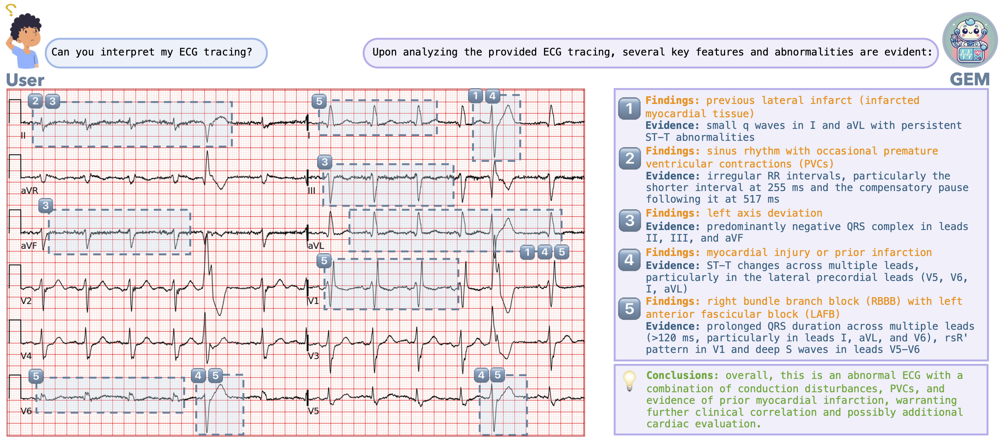

# GEM: Empowering MLLM for Grounded ECG Understanding with Time Series and Images

<p align="left">
    
</p>

## Introduction

GEM is a multimodal LLM unifying ECG time series, 12-lead ECG images and text for grounded and clinician-aligned ECG interpretation. GEM enables feature-grounded analysis, evidence-driven reasoning, and a clinician-like diagnostic process.

## Resource

#### Project Page: 📖 [Page](https://www.lanxplanet.com/GEM-ECG/)

#### Paper: 📄 [Arxiv](https://arxiv.org/pdf/2503.06073)

#### Model: 🤗 [GEM](https://huggingface.co/LANSG/GEM)

#### Data: 🤗 [ECG-Grounding](https://huggingface.co/datasets/LANSG/ECG-Grounding)

## 🔥Updates

- 11 Mar 2025: GEM-7B and ECG-Grounding-30k are now available. 

We will continue to release more ECG-Grounding data and associated beat-level features progressively. 

*Stay tuned for updates!*

## Setup

```shell
git clone https://github.com/lanxiang1017/GEM.git
bash GEM/setup.sh
```

## Data Preparation

Please download required data:

ECG:  
- [MIMIC-IV](https://physionet.org/content/mimic-iv-ecg/1.0/)
- [PTB-XL](https://physionet.org/content/ptb-xl/1.0.3/)
- [Code-15%](https://zenodo.org/records/4916206)
- [CPSC 2018](https://physionet.org/content/challenge-2020/1.0.2/training/cpsc_2018/)
- [CSN](https://physionet.org/content/ecg-arrhythmia/1.0.0/)
- [G12E](https://physionet.org/content/challenge-2020/1.0.2/training/georgia/)

Images:
- [ECG-Grounding-Images](https://huggingface.co/datasets/LANSG/ECG-Grounding) (mimic_gen)
- [ECG-Bench](https://huggingface.co/datasets/PULSE-ECG/ECGBench)

After downloading all of them, organize the data as follows in `./data`,

```
├── ecg_timeseries
    └── champan-shaoxing
    └── code15
    └── cpsc2018
    └── ptbxl
    └── georgia
    └── mimic-iv
├── ecg_images
    └── cod15_v4
    └── csn_aug_all_layout_papersize
    └── csn_ori_layout_papersize
    └── csn_part_noise_layout_papersize
    └── gen_images
      └── mimic_gen
    └── mimic
    └── mimic_v4
    └── ptb-xl
├── ecg_bench
    └── images
    └── ecg-grounding-test.json
├── ecg_jsons
    └── ECG_Grounding_30k.json
├── ecg_grounding_test_data
    └── ecg-grounding-test.json

```

## Pretrained Model Preparation

Pretrained ECG Encoder:
  - [ECG-CoCa](https://github.com/YubaoZhao/ECG-Chat) : place it in ```GEM/ecg_coca/open_clip/checkpoint```

Pretrained MLLMs:
  - [PULSE](https://huggingface.co/PULSE-ECG/PULSE-7B)  
  - [LLaVA](https://huggingface.co/liuhaotian/llava-v1.6-vicuna-7b)

## Train

```bash GEM/scripts/train_gem.sh```

## Evaluation

For ECG-Grounding:
  - step 1. generate interpretations: ```GEM/evaluation/gem_bench/bench_ecggrounding.sh```
  - step 2. process interpretations: ```GEM/gem_evaluation/process_gem_outputs.ipynb```
  - step 3. generate GPT evaluation reports: ```GEM/gem_evaluation/generate_gpt_eval.py```
  - step 4. process evaluation reports and get scores: ```GEM/gem_evaluation/process_grounding_scores.ipynb```

For ECG-Bench:
  - step 1. generate results: ```GEM/evaluation/gem_bench/bench_ecggrounding.sh```
  - step 2. evaluate results: ```GEM/evaluation/evaluate_ecgbench.py```
  - step 3. evaluate reports: ```GEM/evaluation/eval_report.py```

*Note: You'll need to specify result paths first in all evaluation scripts*

## Citation

If you find GEM helpful for your research and applications, please cite our paper:

```bibtex
@misc{lan2025gemempoweringmllmgrounded,
      title={GEM: Empowering MLLM for Grounded ECG Understanding with Time Series and Images}, 
      author={Xiang Lan and Feng Wu and Kai He and Qinghao Zhao and Shenda Hong and Mengling Feng},
      year={2025},
      eprint={2503.06073},
      archivePrefix={arXiv},
      primaryClass={cs.CL},
      url={https://arxiv.org/abs/2503.06073}, 
}
```

## Acknowledgement
We thank the authors of [PULSE](https://github.com/AIMedLab/PULSE/tree/dev) and [ECG-Chat](https://github.com/YubaoZhao/ECG-Chat) for their publicly released models, datasets, and training codes.

